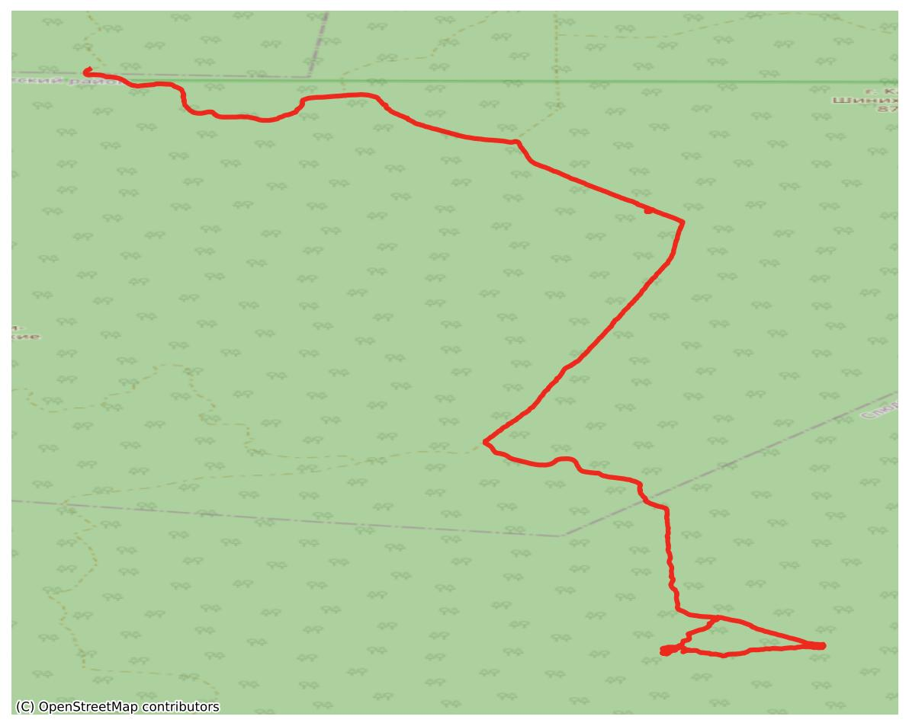
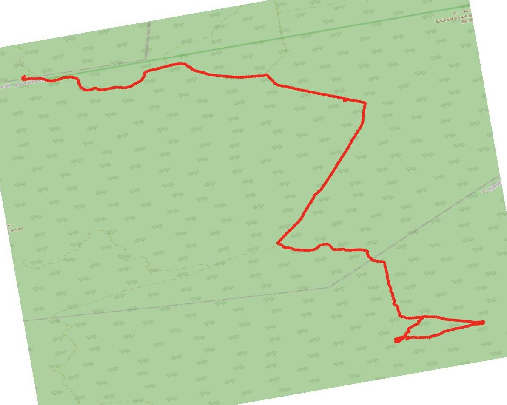
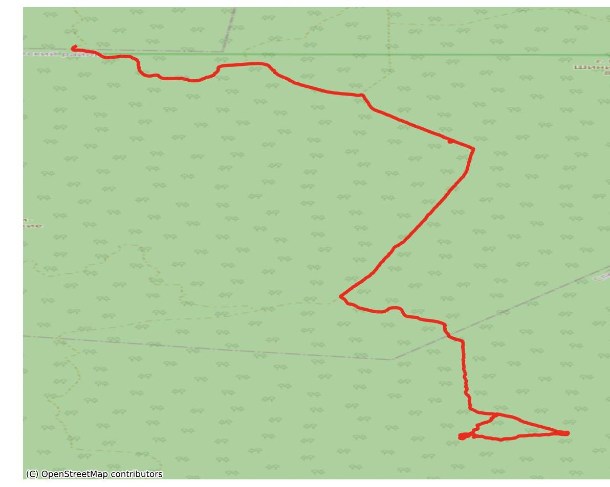
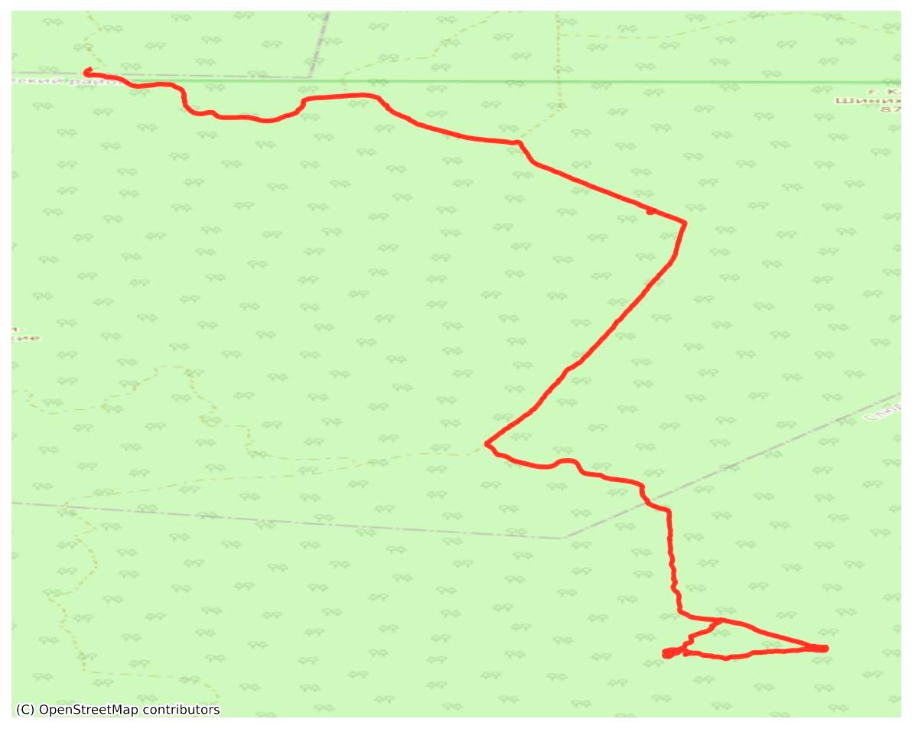
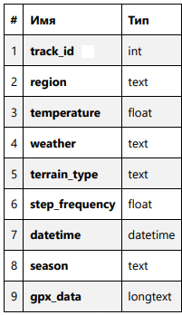
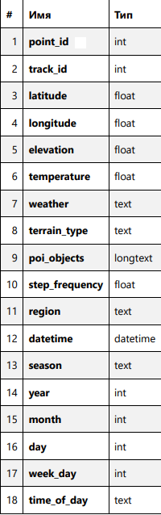

# Отчет по модулю А: Сбор и предобработка данных

## 1. Загрузка и обработка треков
- Автоматическая загрузка GPX-треков по ссылкам с OpenStreetMap
- Парсинг координат, высоты, времени из GPX
- Вычисление частоты шагов (шаг/мин) на основе времени и количества точек

## 2. Получение внешних данных
- **Погода**: запрос к Open-Meteo API (температура, код погоды)
- **Регион**: запрос к Nominatim API (название местности)
- **Объекты вокруг**: Overpass API (здания, дороги, вода, деревья, больницы в радиусе 500 м)
- **Тип местности**: классификация по перепаду высот (равнина, холмы, горы и др.)

## 3. Обогащение данных
- Добавлены признаки всесезонности:
  - `season` (зима/весна/лето/осень)
  - `year`, `month`, `day`
  - `time_of_day` (утро/день/вечер/ночь)
  - `week_day` (день недели)
- Данные сохраняются для каждой точки (с шагом 150 точек для оптимизации запросов POI)

## 4. Визуализация и аугментация карт
- Построение карты с треком через `contextily` + `matplotlib`

{width=50%}

- Автоматическое определение границ и добавление подложки OSM
- Аугментация изображений:
  - Поворот на 10°

  {width=50%}

  - Сдвиг на 30 пикселей

  {width=50%}

  - Увеличение яркости на 20%

  {width=50%}

- Сохранение в папку `pictures/`

## 5. Хранение данных
- **База данных MySQL**:
  - Таблица `track` (общая информация о треке)

  

  - Таблица `points` (поточечные данные)

  

  - Проверка дубликатов по региону и сезону
- **CSV-датасет** (`track_dataset.csv`):
  - Единая таблица со всеми точками всех треков
  - Колонки: track_id, координаты, высота, температура, погода, тип местности, POI, частота шагов, регион, время, сезон, время суток и др.

## 6. Расшифровка атрибутов
- `track_id` — уникальный идентификатор трека (int)
- `latitude`, `longitude` — координаты в градусах (float)
- `elevation` — высота над уровнем моря в метрах (float)
- `step_frequency` — частота шагов в минуту (float)
- `temperature` — максимальная дневная температура в °C (float)
- `weather` — текстовое описание погоды (str)
- `terrain_type` — категория: "Равнина", "Холмы", "Горы" и др. (str)
- `poi_objects` — список объектов поблизости через запятую (str)
- `datetime` — дата и время записи точки (datetime)
- `season` — время года (str)
- `time_of_day` — часть суток (str)

## 7. Библиотеки
- **pandas** — обработка табличных данных
- **pymysql** — работа с базой MySQL
- **requests** — HTTP-запросы к API
- **gpxpy** — парсинг GPX-файлов (треки)
- **os** — работа с файловой системой
- **numpy** — числовые операции с массивами
- **PIL (Image)** — обработка изображений (карты)
- **contextily** — добавление подложки карты
- **matplotlib.pyplot** — построение графиков/карт

## 8. Инструкция по запуску агента
- Запуск терменала
- Перейти в деректорию с скаченным файлом для этого ввести команду в терминал, пример команды:
`cd C:\Users\MO1TE\Desktop\test`
- Создать виртуальное окружение с помощью команды:
`python -m venv .venv`
- Активируем окружение:
`.venv\Scripts\activate.bat`
- Скачать нужные для агента библиотеки:
`pip install -r requirements.txt`
- Запуск агента:
`python ModelA\agenta.py`