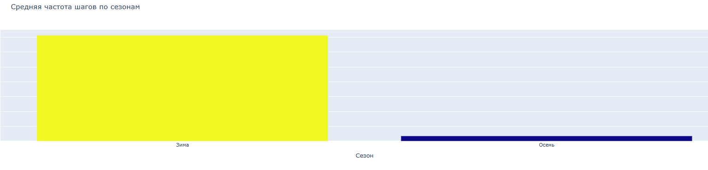
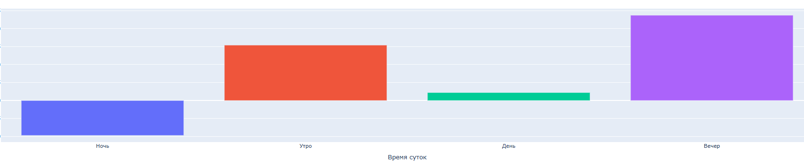
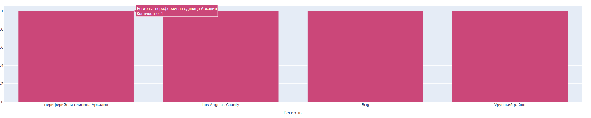
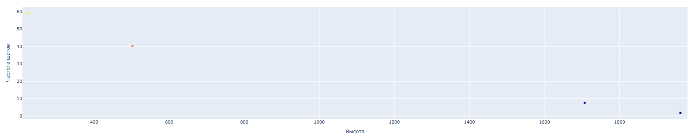
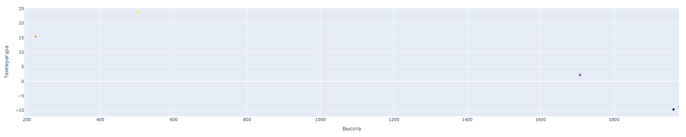
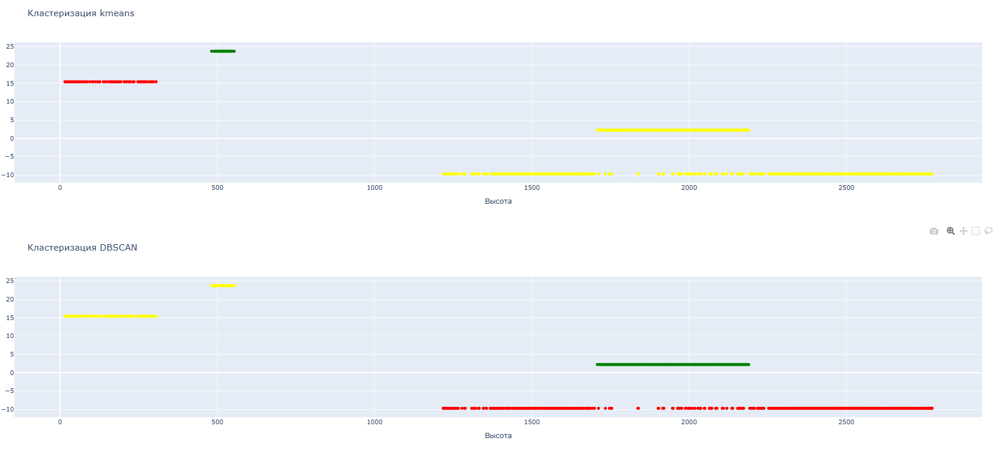
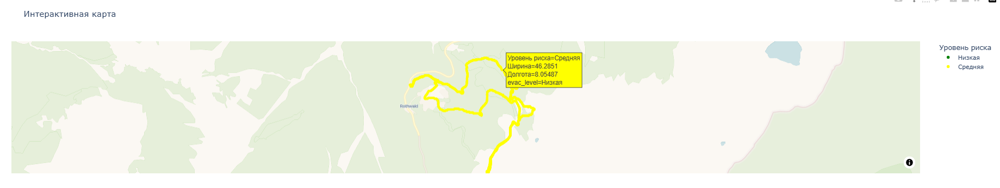
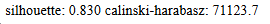

# Отчет по модулю Б: Анализ и визуализация данных

## 1. Аналитическая система
- **Интерактивный дашборд** на Dash с 10+ графиками
- **Подключение к БД** MySQL в реальном времени
- **Фильтры**: регионы, время суток, сезоны

- **Автообновление** при изменении фильтров

## 2. Ключевые аналитические метрики
- **Частота шагов по сезонам** - максимум летом, минимум зимой
- **Температура vs время суток** - дневные максимумы, ночные минимумы
- **Активность по типам местности** - равнины → холмы → горы (по убыванию)
- **Высота vs шаги** - обратная зависимость (выше = медленнее)
- **Популярные регионы** - ТОП-5 по количеству треков

## 3. Кластеризация и разметка рисков
### Методы:
- **K-means** (3 кластера, k-means++ инициализация)
- **DBSCAN** (min_samples=3, определение выбросов)
- **Ручная логика** на основе: высота, температура, погода, тип местности

### Уровни риска:
1. **Низкий** (зеленый): равнины, t>10°C, хорошая погода
2. **Средний** (желтый): холмы, t=0-10°C, облачность
3. **Высокий** (красный): горы, t<-10°C, снегопад

### Эвакуация:
- Аналогичная шкала с весами для высоты и рельефа

## 4. Визуализации
1. **Бар-чарты**:
   - Средние шаги по сезонам

   - Температура по времени суток

   - Активность по регионам

2. **Скаттер-плоты**:
   - Высота vs шаги

   - Высота vs температура

   - Кластеры рисков (K-means и DBSCAN)

3. **Круговая диаграмма**: распределение по типам местности

4. **Интерактивная карта**:
   - Точки маршрутов с цветовой кодировкой рисков
   - Hover-подсказки: уровень риска, эвакуации
   - OpenStreetMap подложка

## 5. Оценка качества
### Метрики кластеризации:

### Визуальная валидация:
- Кластеры соответствуют географическим зонам
- Рисковая разметка логична

## 6. Техническая реализация
### Алгоритм работы:
1. Загрузка данных из БД
2. Применение фильтров
3. Кластеризация (параллельно K-means и DBSCAN)
4. Расчет рисков и эвакуации
5. Генерация 10 графиков
6. Вывод метрик качества

## 7. Библиотеки
- **pandas** — обработка табличных данных
- **pymysql** — работа с базой MySQL
- **os** — работа с файловой системой
- **dash** — фреймворк для веб-дашбордов
- **html** — создание HTML-компонентов
- **dcc** — интерактивные компоненты Dash
- **Input, Output** — callback-декораторы взаимодействия
- **plotly.express** — построение интерактивных графиков
- **sklearn.cluster** — алгоритмы кластеризации
- **sklearn.preprocessing** — масштабирование данных
- **sklearn.metrics** — метрики оценки кластеризации

## 8. Инструкция по запуску агента
- Запуск терменала
- Перейти в деректорию с скаченным файлом для этого ввести команду в терминал, пример команды:
`cd C:\Users\MO1TE\Desktop\test`
- Создать виртуальное окружение с помощью команды:
`python -m venv .venv`
- Активируем окружение:
`.venv\Scripts\activate.bat`
- Скачать нужные для агента библиотеки:
`pip install -r requirements.txt`
- Запуск агента:
`python ModelB\agentb.py`