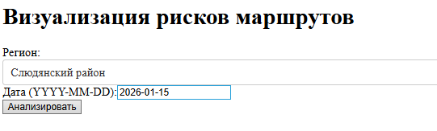
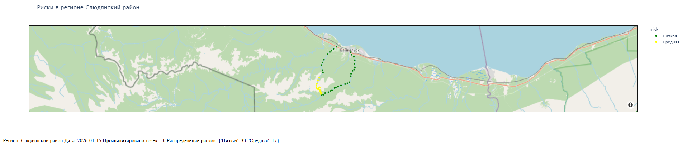

# Отчет по модулю Г

## 1. API (FastAPI)
**Эндпоинт:** `POST /risk`
**Порт:** 8054
**Данные на вход:** координаты, высота, тип местности, дата
**Возвращает:** уровень риска и сложность эвакуации
**Модель:** использует предобученную модель из `model.pkl`

## 2. Графический интерфейс (Dash) 
**Порт:** 8059
**Функционал:**
- Выбор региона из датасета
- Указание даты прогноза
- Кнопка "Анализировать"
- Карта с цветовым кодированием рисков

## 3. Визуализация
- **Зеленый** - низкий риск
- **Желтый** - средний риск  
- **Красный** - высокий риск
- Карта OpenStreetMap

## 4. Пример запроса

**Пример запроса для апи:**

`latitude`: 51.5 - Ширина
`longitude`: 52.3 - Долгота
`elevation`: 1453 - Высота
`terrain_type`: Горы - Тип местности
`track_date`: 2026-04-02 - Дата

Пример ответа в формате json:

`coordinates`:{
    'latitude': 51.5,
    'longitude': 52.3,
},
`prediction`: {
    'risk': Высокий,
    'evacuation': Средний,
},
`factors`: {
    'temperature': -5,
    'elevation': 1453,
    'terrain': Горы,
    'weather': Snow fall,
}

## 5. Библиотеки
- **dash** — фреймворк для дашбордов
- **Input, Output, dcc, html** — компоненты Dash
- **pandas** — обработка табличных данных
- **datetime** — работа с датами
- **plotly.express** — интерактивная визуализация
- **requests** — HTTP-запросы к API
- **numpy** — числовые операции
- **plotly.graph_objects** — продвинутые графики Plotly
- **json** — работа с JSON
- **fastapi** — создание веб-API
- **pickle** — загрузка моделей
- **pydantic** — валидация данных
- **uvicorn** — ASGI-сервер для FastAPI

## 6. Инструкция по запуску агента
- Запуск терменала
- Перейти в деректорию с скаченным файлом для этого ввести команду в терминал, пример команды:
`cd C:\Users\MO1TE\Desktop\test`
- Создать виртуальное окружение с помощью команды:
`python -m venv .venv`
- Активируем окружение:
`.venv\Scripts\activate.bat`
- Скачать нужные для агента библиотеки:
`pip install -r requirements.txt`
- Запуск агента:
`python ModelG\agentg.py`