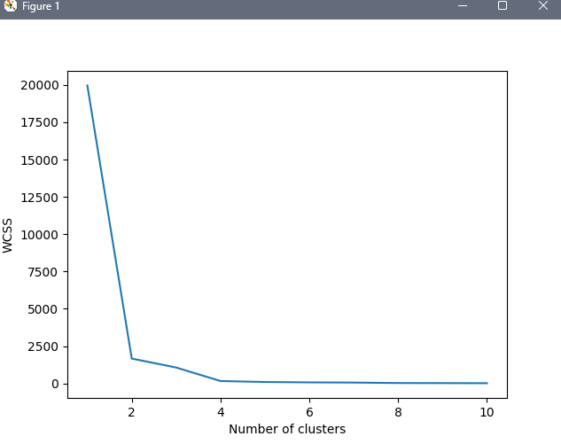
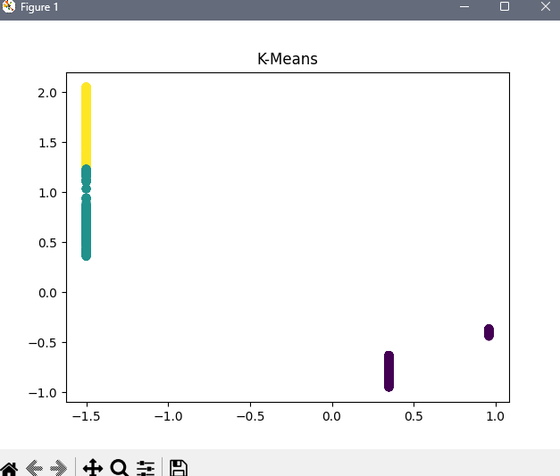

# Отчет по модулю В

## 1. Что делает система
- Определяет уровень риска маршрутов (Низкий/Средний/Высокий)
- Определяет сложность эвакуации
- Автоматически переобучается при новых данных
- Создает и сохраняет модели класификации и кластеризации

## 2. Используемые алгоритмы

### Класификация

- Random Forest
- Logistic Regression
- K-Nearest Neighbors

### Кластеризация

- Метод локтя

- KMeans

## 3. Метрики оценки
- Accuracy (точность)
- Precision (точность по классам)
- F1-score (сбалансированная метрика)

лучшая модель для risk: (RandomForestClassifier(random_state=42), {'accuracy': 1.0, 'precision': 1.0, 'f1': 1.0, 'avg_score': 1.0}, 'RandomForest')
лучшая модель для evacuation: (RandomForestClassifier(random_state=42), {'accuracy': 1.0, 'precision': 1.0, 'f1': 1.0, 'avg_score': 1.0}, 'RandomForest')

## 4. Непрерывное обучение
- Детекция дрифта данных
- Автопереобучение при изменениях
- Сохранение всех версий моделей

## 5. Файловая структура
 - model.pkl # текущая модель
 - version.json # история версий
 - log.csv # лог обучения
 - track_dataset.csv # данные

 ## 6. Библиотеки
- **pandas** — обработка табличных данных
- **os** — работа с файловой системой
- **pickle** — сохранение/загрузка моделей
- **json** — работа с JSON-файлами
- **datetime** — работа с датами
- **matplotlib.pyplot** — построение графиков
- **sklearn.cluster** — алгоритмы кластеризации
- **sklearn.ensemble** — ансамблевые модели
- **sklearn.linear_model** — линейные модели
- **sklearn.metrics** — метрики оценки моделей
- **sklearn.model_selection** — разделение данных
- **sklearn.neighbors** — модель ближайших соседей
- **sklearn.preprocessing** — предобработка данных

## 7. Инструкция по запуску агента
- Запуск терменала
- Перейти в деректорию с скаченным файлом для этого ввести команду в терминал, пример команды:
`cd C:\Users\MO1TE\Desktop\test`
- Создать виртуальное окружение с помощью команды:
`python -m venv .venv`
- Активируем окружение:
`.venv\Scripts\activate.bat`
- Скачать нужные для агента библиотеки:
`pip install -r requirements.txt`
- Запуск агента:
`python ModelV\agentv.py`